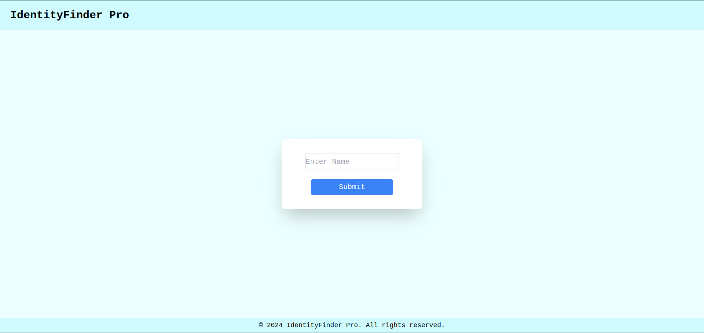
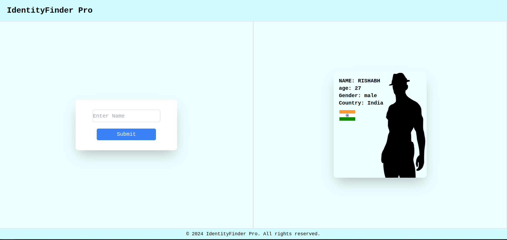

```markdown
# IdentityFinder Pro Application

IdentityFinder Pro is a Next.js application designed to provide insights into a person's identity based on their name. It utilizes a set of APIs to gather information such as age, gender, country code, and flag image associated with the provided name.

## APIs Used

1. **Age API**:
   - Endpoint: [https://api.agify.io?name=](https://api.agify.io?name=)
   - Description: This API predicts the age of a person based on their name.

2. **Gender API**:
   - Endpoint: [https://api.genderize.io?name=](https://api.genderize.io?name=)
   - Description: This API predicts the gender of a person based on their name.

3. **Country Code API**:
   - Endpoint: [https://api.nationalize.io?name=](https://api.nationalize.io?name=)
   - Description: This API predicts the most likely countries associated with a given name and provides their country codes.

4. **Flag Image API**:
   - Endpoint: [https://flagsapi.com/:country_code/:style/:size.png](https://flagsapi.com/:country_code/:style/:size.png)
   - Description: This API provides flag images of countries based on their country codes. 

## Example Usage

Suppose we have a name "John". Using the IdentityFinder Pro application, we can retrieve the following information:

- Age: Predicted age of Rishabh.
- Gender: Predicted gender of Rishabh.
- Country Code: Most likely countries associated with the name Rishabh along with their country codes.
- Flag Image: Flag image(s) of the country/countries associated with the name Rishabh.

### UI Images



## Installation

To install and run the IdentityFinder Pro application locally, follow these steps:

1. Clone the repository.
2. Navigate to the project directory.
3. Install dependencies using `npm install`.
4. Start the application using `npm run dev`.


## Contributions

Contributions to the IdentityFinder Pro application are welcome! Feel free to submit issues, feature requests, or pull requests to help improve the application.

```

Feel free to modify it according to your preferences and add any additional information or sections you deem necessary!